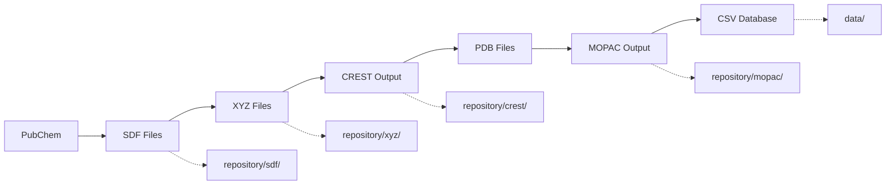

# Grimperium v2 - Estrutura do Projeto

## 📁 Visão Geral da Estrutura

Este documento apresenta a estrutura completa de diretórios e arquivos do projeto Grimperium v2, um sistema de automação de workflows para química computacional.

```
grimperium/
├── 📋 Documentação de Projeto
├── ⚙️ Configuração
├── 🧪 Código Principal (grimperium/)
├── 🚀 Ponto de Entrada (main.py)
└── 🧪 Arquivos de Teste
```

---

## 📂 Estrutura Detalhada de Diretórios

### 📋 **Raiz do Projeto**
```
/home/igor_fern/projects/grimperium/
├── ACTION_PLAN.md              # Plano de desenvolvimento por fases
├── ARCHITECTURE_v2.md          # Documentação da arquitetura do sistema
├── DATABASE_SCHEMA_v2.md       # Esquema dos bancos de dados
├── INSTALL_v2.md               # Instruções de instalação
├── PRD_v2.md                   # Product Requirements Document
├── README_v2.md                # Documentação principal do projeto
├── config.yaml                 # Arquivo de configuração principal
├── main.py                     # Ponto de entrada da aplicação CLI
├── test_batch.txt              # Arquivo de teste com moléculas de exemplo
└── PROJECT_STRUCTURE.md        # Este arquivo
```

### 🧪 **Pacote Principal (grimperium/)**
```
grimperium/
├── __init__.py                 # Inicialização do pacote Python
├── config/                     # Configurações específicas do sistema
│   └── __init__.py
├── core/                       # Modelos de domínio centrais
│   ├── __init__.py
│   └── molecule.py             # Classe Molecule (Pydantic BaseModel)
├── data/                       # Diretório para bancos de dados CSV
│   └── __init__.py
├── interfaces/                 # Interfaces futuras (APIs, web)
│   └── __init__.py
├── logs/                       # Diretório para arquivos de log
│   └── __init__.py
├── repository/                 # Diretório de trabalho para arquivos moleculares
│   ├── __init__.py
│   ├── crest/                  # Arquivos de saída do CREST
│   │   └── __init__.py
│   ├── mopac/                  # Arquivos de saída do MOPAC
│   │   └── __init__.py
│   ├── sdf/                    # Arquivos SDF (estruturas 3D)
│   │   └── __init__.py
│   └── xyz/                    # Arquivos XYZ (coordenadas)
│       └── __init__.py
├── services/                   # Serviços de negócio
│   ├── __init__.py
│   ├── analysis/               # Serviços de análise específicos
│   │   └── __init__.py
│   ├── analysis_service.py     # Análise de progresso e relatórios
│   ├── calculation_service.py  # Integração com CREST e MOPAC
│   ├── conversion_service.py   # Conversão de formatos (OpenBabel)
│   ├── database_service.py     # Persistência thread-safe em CSV
│   ├── pipeline_orchestrator.py # Orquestração do pipeline completo
│   └── pubchem_service.py      # Integração com PubChem
├── tests/                      # Testes automatizados
│   ├── __init__.py
│   └── test_pipeline_orchestrator.py # Testes do orquestrador principal
└── utils/                      # Utilitários de apoio
    ├── __init__.py
    └── config_manager.py       # Gerenciamento de configuração YAML
```

---

## 📄 Descrição Detalhada dos Arquivos

### 📋 **Documentação do Projeto**

| Arquivo | Descrição |
|---------|-----------|
| `ACTION_PLAN.md` | Plano mestre de desenvolvimento organizado em fases |
| `ARCHITECTURE_v2.md` | Arquitetura do software e decisões de design |
| `DATABASE_SCHEMA_v2.md` | Esquema e estrutura dos bancos de dados CSV |
| `INSTALL_v2.md` | Instruções de instalação e dependências |
| `PRD_v2.md` | Requisitos do produto e especificações funcionais |
| `README_v2.md` | Documentação principal e guia de uso |

### ⚙️ **Configuração**

| Arquivo | Descrição |
|---------|-----------|
| `config.yaml` | Configuração principal: executáveis, keywords, paths, logging |

### 🚀 **Ponto de Entrada**

| Arquivo | Descrição |
|---------|-----------|
| `main.py` | CLI principal com comandos: `run-single`, `run-batch`, `report`, `info` |

### 🧪 **Código Principal**

#### **Core (Modelos de Domínio)**
| Arquivo | Descrição |
|---------|-----------|
| `core/molecule.py` | Classe `Molecule` usando Pydantic para validação de dados |

#### **Services (Lógica de Negócio)**
| Arquivo | Descrição |
|---------|-----------|
| `services/pubchem_service.py` | Download de estruturas moleculares do PubChem |
| `services/conversion_service.py` | Conversão entre formatos usando OpenBabel |
| `services/calculation_service.py` | Execução de CREST e MOPAC + parsing de resultados |
| `services/database_service.py` | Persistência thread-safe em CSV com FileLock |
| `services/pipeline_orchestrator.py` | Orquestração completa do workflow |
| `services/analysis_service.py` | Análise de progresso e geração de relatórios |

#### **Utils (Utilitários)**
| Arquivo | Descrição |
|---------|-----------|
| `utils/config_manager.py` | Carregamento e validação de configuração YAML |

#### **Tests (Testes Automatizados)**
| Arquivo | Descrição |
|---------|-----------|
| `tests/test_pipeline_orchestrator.py` | Testes com mocks inteligentes para subprocess |

### 🗂️ **Diretórios de Dados e Trabalho**

| Diretório | Finalidade |
|-----------|------------|
| `data/` | Armazenamento de bancos de dados CSV (thermo_cbs.csv, thermo_pm7.csv) |
| `logs/` | Arquivos de log detalhados da aplicação |
| `repository/` | Área de trabalho para arquivos moleculares por cálculo |
| `repository/sdf/` | Arquivos SDF baixados do PubChem |
| `repository/xyz/` | Arquivos XYZ convertidos |
| `repository/crest/` | Resultados de busca conformacional |
| `repository/mopac/` | Resultados de cálculos quânticos |

---

## 🎯 **Fluxo de Arquivos no Pipeline**



---

## 🔧 **Arquivos de Configuração e Teste**

### **config.yaml**
```yaml
executables:
  crest: 'crest'
  mopac: 'mopac'
  obabel: 'obabel'

mopac_keywords: 'PM7 PRECISE XYZ'
crest_keywords: '--gfn2'

logging:
  log_file: 'logs/grim_details.log'
  console_level: 'INFO'
  file_level: 'DEBUG'

database:
  cbs_db_path: 'data/thermo_cbs.csv'
  pm7_db_path: 'data/thermo_pm7.csv'
```

### **test_batch.txt**
```
methane
ethanol
water
```

---

## 📊 **Estatísticas do Projeto**

| Métrica | Valor |
|---------|-------|
| **Total de Arquivos Python** | 11 |
| **Total de Módulos de Serviço** | 6 |
| **Total de Arquivos de Teste** | 1 |
| **Total de Arquivos de Documentação** | 7 |
| **Diretórios de Código** | 8 |
| **Comandos CLI Disponíveis** | 4 |

---

## 🏗️ **Arquitetura Modular**

O projeto segue uma arquitetura modular clara:

- **🎯 Separação de Responsabilidades**: Cada serviço tem uma responsabilidade específica
- **🔗 Baixo Acoplamento**: Módulos independentes comunicam-se através de interfaces bem definidas
- **🧪 Testabilidade**: Estrutura permite testes unitários e de integração
- **📈 Escalabilidade**: Fácil adição de novos serviços e funcionalidades
- **🔧 Configurabilidade**: Comportamento controlado por configuração externa

---

## 🚀 **Comandos Principais Disponíveis**

```bash
# Processar molécula única
python main.py run-single --name "ethanol"
python main.py run-single --smiles "CCO"

# Processar lote de moléculas
python main.py run-batch molecules.txt

# Gerar relatório de progresso
python main.py report
python main.py report --detailed
python main.py report --missing 10

# Informações do sistema
python main.py info

# Executar testes
pytest tests/
```

---

## 📝 **Notas de Desenvolvimento**

- **Python 3.8+**: Compatibilidade mínima
- **Dependências Principais**: Typer, Rich, Pydantic, Pandas, PubChemPy, FileList
- **Padrão de Código**: PEP 8, Type Hints, Docstrings detalhadas
- **Logging**: Estruturado com níveis configuráveis
- **Testes**: pytest com mocks inteligentes
- **Configuração**: YAML centralizada e validada

**Grimperium v2 - Sistema completo de automação para química computacional** 🧪✨