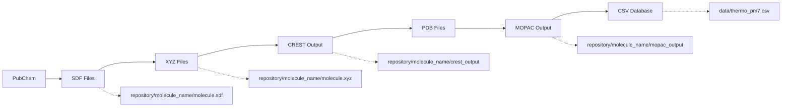

# Grimperium v2 - Estrutura do Projeto

## 📁 Visão Geral da Estrutura

Este documento apresenta a estrutura completa de diretórios e arquivos do projeto Grimperium v2, um sistema de automação de workflows para química computacional.

```
grimperium/
├── 📋 Documentação de Projeto
├── ⚙️ Configuração
├── 🧪 Código Principal (grimperium/)
├── 🚀 Ponto de Entrada (main.py)
└── 🧪 Arquivos de Teste
```

---

## 📂 Estrutura Detalhada de Diretórios

### 📋 **Raiz do Projeto**
```
/home/igor/Projetos/grimperium/
├── .coderabbit.yaml
├── .flake8
├── .gitignore
├── AGENT.md
├── CLAUDE.md
├── codecov.yml
├── config.yaml
├── GEMINI.md
├── main.py
├── MOPAC Error message.txt
├── requirements.txt
├── setup_environment.sh
├── .github/
├── data/
├── docs/
├── grimperium/
├── lists/
├── logs/
└── repository/
```

### 🧪 **Pacote Principal (grimperium/)**
```
grimperium/
├── __init__.py
├── constants.py
├── exceptions.py
├── config/
│   ├── __init__.py
│   └── defaults.py
├── core/
│   ├── __init__.py
│   └── molecule.py
├── services/
│   ├── __init__.py
│   ├── analysis_service.py
│   ├── calculation_service.py
│   ├── conversion_service.py
│   ├── database_service.py
│   ├── pipeline_orchestrator.py
│   └── pubchem_service.py
├── tests/
│   ├── __init__.py
│   ├── test_base_service.py
│   ├── test_config_manager.py
│   ├── test_database_service.py
│   ├── test_error_handler.py
│   ├── test_file_utils.py
│   ├── test_interactive_batch.py
│   ├── test_pipeline_orchestrator.py
│   └── test_subprocess_utils.py
├── ui/
│   ├── __init__.py
│   └── interactive_batch.py
└── utils/
    ├── __init__.py
    ├── base_service.py
    ├── config_manager.py
    ├── error_handler.py
    ├── file_utils.py
    └── subprocess_utils.py
```

---

## 📄 Descrição Detalhada dos Arquivos

### 📋 **Documentação do Projeto**

| Arquivo | Descrição |
|---------|-----------|
| `docs/architecture.md` | Arquitetura do software e decisões de design |
| `docs/database_schema.md`| Esquema e estrutura dos bancos de dados CSV |
| `docs/project_struture.md`| Este arquivo, descrevendo a estrutura do projeto |
| `docs/README.md` | Documentação principal e guia de uso |

### ⚙️ **Configuração**

| Arquivo | Descrição |
|---------|-----------|
| `config.yaml` | Configuração principal: executáveis, keywords, paths, logging |

### 🚀 **Ponto de Entrada**

| Arquivo | Descrição |
|---------|-----------|
| `main.py` | CLI principal com comandos: `run-single`, `run-batch`, `report`, `info` |

### 🧪 **Código Principal**

#### **Core (Modelos de Domínio)**
| Arquivo | Descrição |
|---------|-----------|
| `core/molecule.py` | Classe `Molecule` usando Pydantic para validação de dados |

#### **Services (Lógica de Negócio)**
| Arquivo | Descrição |
|---------|-----------|
| `services/pubchem_service.py` | Download de estruturas moleculares do PubChem |
| `services/conversion_service.py` | Conversão entre formatos usando OpenBabel |
| `services/calculation_service.py` | Execução de CREST e MOPAC + parsing de resultados |
| `services/database_service.py` | Persistência thread-safe em CSV com FileLock |
| `services/pipeline_orchestrator.py` | Orquestração completa do workflow |
| `services/analysis_service.py` | Análise de progresso e geração de relatórios |

#### **Utils (Utilitários)**
| Arquivo | Descrição |
|---------|-----------|
| `utils/config_manager.py` | Carregamento e validação de configuração YAML |
| `utils/error_handler.py` | Tratamento centralizado de erros |
| `utils/file_utils.py` | Funções para manipulação de arquivos |
| `utils/subprocess_utils.py` | Utilitário para executar comandos de shell externos |
| `utils/base_service.py` | Classe base para serviços com funcionalidade comum |

#### **UI (Interface com Usuário)**
| Arquivo | Descrição |
|---------|-----------|
| `ui/interactive_batch.py` | Fornece a interface de linha de comando interativa |

#### **Tests (Testes Automatizados)**
| Arquivo | Descrição |
|---------|-----------|
| `tests/test_pipeline_orchestrator.py` | Testes do orquestrador principal |
| `tests/test_database_service.py` | Testes do serviço de banco de dados |
| `tests/test_config_manager.py` | Testes do gerenciador de configuração |
| `tests/test_error_handler.py` | Testes do tratador de erros |
| `tests/test_file_utils.py` | Testes dos utilitários de arquivo |
| `tests/test_subprocess_utils.py` | Testes dos utilitários de subprocesso |
| `tests/test_interactive_batch.py` | Testes da interface interativa |
| `tests/test_base_service.py` | Testes da classe de serviço base |

### 🗂️ **Diretórios de Dados e Trabalho**

| Diretório | Finalidade |
|-----------|------------|
| `data/` | Armazenamento de bancos de dados CSV e listas de moléculas |
| `logs/` | Arquivos de log detalhados da aplicação |
| `repository/` | Área de trabalho para arquivos moleculares por cálculo |

---

## 🎯 **Fluxo de Arquivos no Pipeline**



---

## 🏗️ **Arquitetura Modular**

O projeto segue uma arquitetura modular clara:

- **🎯 Separação de Responsabilidades**: Cada serviço tem uma responsabilidade específica
- **🔗 Baixo Acoplamento**: Módulos independentes comunicam-se através de interfaces bem definidas
- **🧪 Testabilidade**: Estrutura permite testes unitários e de integração
- **📈 Escalabilidade**: Fácil adição de novos serviços e funcionalidades
- **🔧 Configurabilidade**: Comportamento controlado por configuração externa

---

## 🚀 **Comandos Principais Disponíveis**

```bash
# Processar molécula única
python main.py run-single --name "ethanol"
python main.py run-single --smiles "CCO"

# Processar lote de moléculas
python main.py run-batch molecules.txt

# Gerar relatório de progresso
python main.py report
python main.py report --detailed
python main.py report --missing 10

# Informações do sistema
python main.py info

# Executar testes
pytest tests/
```
